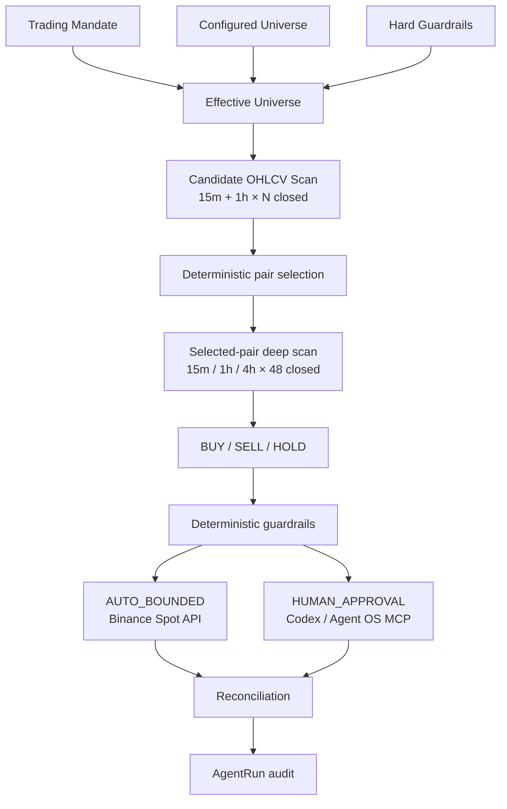

# DARWIN

> Give DARWIN a trading mandate and hard risk boundaries. DARWIN decides what,
> when, and how to trade within those limits.

DARWIN is an owner-operated Binance Spot trading agent. The model can choose a
pair and return a typed `BUY`, `SELL`, or `HOLD` decision, but backend policy,
budget, freshness, balance, symbol filters, concurrency, and execution-mode
checks remain the authorization source.

## Judge Quickstart

The fastest way to inspect the product is the deterministic, zero-credential
Demo Mode:

```bash
git clone https://github.com/riyannode/DARWIN.git
cd DARWIN
docker compose up --build
```

Open [http://localhost:3000/demo](http://localhost:3000/demo).

Demo Mode requires no `.env`, OpenAI key, Binance key, Binance OAuth, Codex,
Telegram, funded account, or external LLM account. The Compose path uses the
backend, frontend, and a local SQLite database only.

### Demo Mode disclosure

The `/demo` experience is prominently labelled:

- **DEMO MODE**
- Deterministic synthetic Binance-format fixture evidence
- No LLM API call
- No live Binance connection
- Financial writes disabled by a backend guard

The three available scenarios are computed by the backend and selected through
read-only `GET` routes:

| Scenario | Model decision | Policy | System outcome |
| --- | --- | --- | --- |
| `valid-buy` | `BUY BTCUSDT` | `PASS` | `SKIPPED / DEMO_EXECUTION_BLOCKED` |
| `max-notional` | `BUY SOLUSDT` | `REJECTED` | `SKIPPED / POLICY_REJECTED / MAX_ORDER_NOTIONAL` |
| `hold` | `HOLD ETHUSDT` | Not applicable | `SKIPPED / NO_TRADE` |

Demo proves mandate/effective-universe behavior, typed decisions, policy and
budget evaluation, safe lifecycle presentation, auditability, and product UX.
It does **not** prove live OpenAI inference, Binance authentication, or live
order execution.

## 30-second architecture



The production pipeline scans every effective symbol with 10 closed `15m` and
`1h` candles, selects one pair, then fetches 48 closed candles for the selected
pair across `15m`, `1h`, and `4h`. The final model decision is bound to that
selected pair. Demo Mode reuses the mapper, typed evidence models, effective
universe logic, `AgentDecision`, budget calculation, and deterministic policy
against fixed fixture data.

## Two product experiences

### LIVE MODE

LIVE MODE uses the configured providers and persisted production state:

- public Binance Spot market-history adapter for closed OHLCV;
- Binance Spot API for `AUTO_BOUNDED` authenticated reads/writes;
- Codex App Server plus Binance Agent OS MCP for `HUMAN_APPROVAL`;
- OpenAI or the configured OpenAI-compatible gateway for the decision runtime;
- PostgreSQL for mandates, budgets, runs, intents, approvals, outbox work, and
  order events;
- Telegram for optional approval and receipt delivery.

The live operator UI requires owner authentication. Missing authentication or
provider configuration reports unavailable state and does not fabricate account
or market results.

### DEMO MODE

`DEMO_MODE=true` enables only the deterministic read-only judge routes. The
backend financial-write guard raises `DemoFinancialWriteBlocked` before any
new-order or cancellation transport can be reached. The direct Spot and Codex
write seams also enforce the guard, so missing credentials are not the safety
mechanism.

## AUTO_BOUNDED vs HUMAN_APPROVAL

| Mode | DARWIN behavior | Financial transport |
| --- | --- | --- |
| `AUTO_BOUNDED` | Decides and may execute within backend-enforced limits; no per-order human approval | Binance Spot API |
| `HUMAN_APPROVAL` | Decides, then waits for supervised approval and fresh revalidation | Codex + Binance Agent OS MCP |

Public OHLCV mapping is not an authorization transport. Both modes use the
same typed closed-candle evidence and deterministic policy checks.

## Safety model

The backend owns the trusted decisions:

- one canonical free-text Trading Mandate;
- configured universe, mandate Allowed Symbols, and effective intersection;
- Max Per Trade, rolling 24h BUY Budget, and Max Concurrent Trades;
- balances, symbol filters, freshness, open-order conflicts, and emergency stop;
- durable idempotent intents and state transitions;
- fresh revalidation before a possible write;
- `SUBMISSION_UNKNOWN` and reconciliation semantics;
- Spot-only execution with transfers and withdrawals unsupported.

`HOLD` is a model decision. `SKIPPED` is a system outcome. A skipped demo BUY
is never an executed order.

## Agent OS integration

Codex is an authentication/transport adapter only. DARWIN chooses the pair,
produces the model decision, evaluates policy, owns lifecycle state, and
reconciles exchange state. DARWIN does not send Codex natural-language trading
prompts, and Codex does not choose trades or override policy.

The authenticated live bridge remains `PENDING` until genuine OAuth, read-only
MCP, and write-confirmation behavior have been manually verified.

## Live setup

Copy the backend example for live configuration only:

```bash
cp backend/.env.example backend/.env
```

Set `DATABASE_URL`, `OPENAI_API_KEY`, `OWNER_PASSWORD_HASH`,
`FRONTEND_ORIGIN`, and the required Codex/Binance/Telegram values for the
chosen mode. Keep `DEMO_MODE=false` for live operation. Never commit secrets.

For local development without Compose:

```bash
cd backend
uv sync --frozen
PYTHONPATH=src uv run alembic upgrade head
PYTHONPATH=src uv run uvicorn darwinspot.main:app --host 127.0.0.1 --port 8000

cd ../frontend
pnpm install --frozen-lockfile
BACKEND_URL=http://127.0.0.1:8000 pnpm build
HOSTNAME=127.0.0.1 PORT=3000 pnpm start
```

## Repository structure

```text
frontend/   Next.js operator and judge interfaces
backend/    FastAPI API, decision pipeline, policy, transports, persistence
 docs/      architecture, deployment, runbooks, product, demo notes
```

## Video run-of-show

A truthful 60–90 second walkthrough can show:

1. **0–10s:** thesis and the mandate → scan → decision → guardrails diagram.
2. **10–25s:** configured universe, Allowed Symbols, and hard guardrails.
3. **25–40s:** candidate symbols and selected-pair evidence.
4. **40–55s:** closed 15m/1h/4h OHLCV, decision, rationale, and confidence.
5. **55–70s:** policy evaluation and explicit safe system outcome.
6. **70–90s:** AUTO_BOUNDED, HUMAN_APPROVAL, reconciliation, and auditability.

Do not present Demo Mode fixtures as live Binance data.

## Verification status

Implemented and locally verified:

- backend Ruff, Pyright, Python compilation;
- frontend ESLint, TypeScript, and production build;
- deterministic Demo Mode API responses for all three scenarios;
- backend write-barrier paths and read-only demo routes.

The host used for this branch does not have Docker or Chromium installed, so
Compose image execution and browser pixel verification remain pending. GitHub
has no configured check runs for this repository. Live Codex/Binance
authentication and funded financial writes were not performed.
