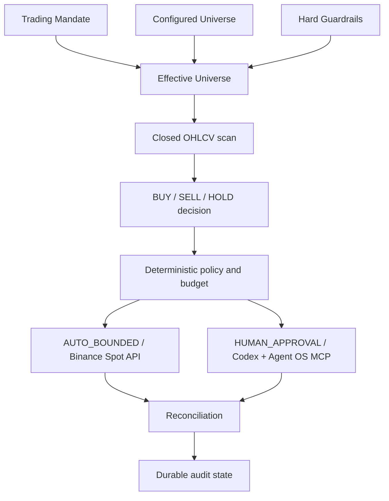

# DARWIN

> Give DARWIN a trading mandate and hard risk boundaries. DARWIN decides what,
> when, and how to trade within those limits.

DARWIN is an owner-operated Binance Spot trading agent. A model can choose a
pair and return a typed `BUY`, `SELL`, or `HOLD` decision, while backend policy,
budget, freshness, balance, symbol filters, concurrency, and execution-mode
checks remain the authorization source.

## Judge Quickstart

The fastest way to inspect DARWIN is the deterministic, zero-credential Demo
Mode runtime:

```bash
git clone https://github.com/riyannode/DARWIN.git
cd DARWIN
docker compose up --build
```

Open:

```text
http://localhost:3000/demo
```

No `.env` is required. The root Compose runtime sets `DEMO_MODE=true` and uses
local SQLite. It does not require or use:

- an OpenAI key or other model-provider key;
- Binance credentials or a funded account;
- Codex authentication or Binance Agent OS OAuth;
- Telegram configuration.

The runtime uses deterministic synthetic Binance-format fixtures, makes no live
Binance connection, makes no LLM API call, and blocks financial writes in the
backend before any execution transport can be reached.

The three scenarios are:

| Scenario | Decision | Policy | System outcome |
| --- | --- | --- | --- |
| `valid-buy` | `BUY BTCUSDT` | `PASS` | `SKIPPED / DEMO_EXECUTION_BLOCKED` |
| `max-notional` | `BUY SOLUSDT` | `REJECTED` (policy-rejected) / `MAX_ORDER_NOTIONAL` | `SKIPPED` |
| `hold` | `HOLD ETHUSDT` | `NOT_APPLICABLE` | `SKIPPED / NO_TRADE` |

Stop and reset the judge runtime:

```bash
docker compose down -v --remove-orphans
```

## Three runtime profiles

DARWIN supports two judge-facing proof paths and one operator-controlled trading
profile. The flags are an explicit final authorization layer; they do not bypass
policy, budget, emergency stop, HUMAN_APPROVAL, Codex confirmation, or transport
checks.

### JUDGE DEMO

```dotenv
DEMO_MODE=true
FINANCIAL_WRITES_ENABLED=false
PUBLIC_SHOWCASE_ENABLED=false
```

This is the root Docker Compose runtime: deterministic synthetic fixtures, zero
credentials, no external LLM, no live Binance market reads, and financial writes
blocked. Open `http://localhost:3000/demo`.

### PUBLIC LIVE SHOWCASE

```dotenv
DEMO_MODE=false
FINANCIAL_WRITES_ENABLED=false
PUBLIC_SHOWCASE_ENABLED=true
```

This uses the real model, real Binance public market evidence, real scheduled
worker decisions, persisted AgentRun evidence, and a public read-only
`http://localhost:3000/showcase` page. Financial writes are disabled; a
policy-passing BUY/SELL completes locally as `FINANCIAL_WRITES_DISABLED` before
any intent or proposal is created. No Binance order is created. Judges do not
need owner credentials to inspect the showcase; operator configuration and
mutations remain private.

### REAL LIVE TRADING

```dotenv
DEMO_MODE=false
FINANCIAL_WRITES_ENABLED=true
PUBLIC_SHOWCASE_ENABLED=false
```

Recommended operator profile for real model/Binance operation. Financial
execution may proceed only after the existing deterministic policy, budget,
emergency-stop, HUMAN_APPROVAL/Codex confirmation, revalidation, and transport
gates pass. Funded E2E execution is not claimed as verified here.

## Demo versus Live

The root `docker-compose.yml` remains the safe JUDGE DEMO runtime. It is not the
production live deployment. See [docs/LIVE.md](docs/LIVE.md) for the complete
credential matrix and [docs/DEPLOYMENT.md](docs/DEPLOYMENT.md) for topology.

## AUTO_BOUNDED vs HUMAN_APPROVAL

| Mode | Behavior | Execution transport | Per-order approval |
| --- | --- | --- | --- |
| `AUTO_BOUNDED` | Executes only after backend policy and fresh revalidation pass | Binance Spot API | Not required |
| `HUMAN_APPROVAL` | Creates a proposal and waits for supervised authorization | Codex App Server + Binance Agent OS MCP | Required |

Telegram notification is not financial authorization. HUMAN_APPROVAL also
supports web approval; AUTO_BOUNDED does not require Telegram approval.

## Verification Status

Current repository verification status:

- **Demo/Judge Docker runtime:** VERIFIED.
- **Exact `http://localhost:3000/demo` and
  `http://localhost:3000/api/demo/scenarios` path:** VERIFIED on a clean host
  port-3000 re-test.
- **Scenario count and SQLite zero-row write proof:** VERIFIED.
- **Chromium/browser pixel verification:** DEFERRED / UNVERIFIED.
- **AUTO_BOUNDED funded live execution:** NOT VERIFIED; no funded order was
  submitted.
- **HUMAN_APPROVAL authenticated Codex/Binance live acceptance:** PENDING /
  NOT VERIFIED.

This repository does not claim fully production-verified live trading.

## Safety Model

The backend owns trusted decisions:

- Trading Mandate, configured universe, allowed symbols, and their effective
  intersection;
- Max Per Trade, rolling 24-hour BUY Budget, and Max Concurrent Trades;
- balances, symbol filters, freshness, open-order conflicts, and emergency stop;
- durable idempotent intents, state transitions, and reconciliation;
- fresh revalidation before a possible write;
- `SUBMISSION_UNKNOWN` handling;
- Spot-only execution, with transfers and withdrawals unsupported.

A `HOLD` is a model decision. `SKIPPED` is a system outcome. A skipped demo BUY
is never an executed order.

## Architecture



The production pipeline and both execution modes share typed evidence and
backend policy. Codex is an authentication/transport adapter; it does not
choose trades or override policy.

## Live Setup

For local installation of the API, required worker, frontend, and mode-specific
credentials, follow [docs/LIVE.md](docs/LIVE.md). The short shape is:

```bash
cd backend
uv sync --frozen
cp .env.example .env
PYTHONPATH=src uv run alembic upgrade head
PYTHONPATH=src uv run uvicorn darwinspot.main:app --host 0.0.0.0 --port 8000
```

The worker is a separate required process:

```bash
cd backend
PYTHONPATH=src uv run python -m darwinspot.worker
```

Starting FastAPI without the worker is not a complete live deployment.

## Repository Structure

```text
frontend/  Next.js operator and judge interfaces
backend/   FastAPI API, worker, policy, transports, and persistence
docs/      architecture, deployment, demo, live setup, and runbooks
```
