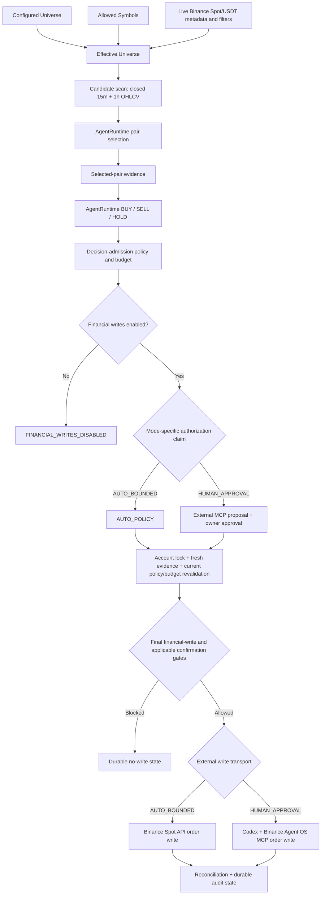

# DARWIN Architecture

## Authority boundary

DARWIN is a custom decision runtime, not a policy-free model wrapper. Its `AgentRuntime` uses the OpenAI SDK and optionally `OPENAI_BASE_URL` for an OpenAI-compatible endpoint. It makes two typed model calls:

1. `choose_pair()` returns one strict Pydantic `PairSelection`.
2. `decide()` returns one strict Pydantic `AgentDecision`: `BUY`, `SELL`, or `HOLD`, with pair/order details, confidence, rationale, supporting factors, and risk factors.

Invalid JSON, extra fields, or invalid Pydantic output gets one schema-correction attempt; unresolved output fails closed. Pydantic validates model output—it is not an agent framework.

The model decides a proposed trade. The deterministic backend owns the Trading Mandate, Allowed Symbols, Max Per Trade, 24h Trading Budget, Max Concurrent Trades, Configured Universe, balances, filters, freshness, open-order conflict, emergency stop, financial-write gate, and durable execution state.

## Decision flow



### Universe and evidence

A newly created Configured Universe defaults to `BTCUSDT`, `ETHUSDT`, `BNBUSDT`, `SOLUSDT`, and `XRPUSDT`. Owners may configure up to 100 valid uppercase Spot/USDT symbols. The five defaults are not a dynamic top-five strategy or a runtime limit. A database upgraded from before `0004_dual_execution_and_universe` can retain that migration's four-symbol compatibility value (`BTCUSDT`, `ETHUSDT`, `BNBUSDT`, `SOLUSDT`) until its owner explicitly updates the stored universe.

```text
Effective Universe = Configured Universe ∩ Allowed Symbols ∩ live-valid Binance Spot/USDT symbols
```

A cycle uses live exchange metadata and required filters to derive that intersection. It fetches 10 closed candles for `15m` and `1h` for every effective candidate with bounded concurrency of eight. A failed candidate is excluded, recorded as a sanitized failure in that run's `pair_selection` evidence, and does not create a child run. If no candidate remains, the cycle completes as `NO_EFFECTIVE_SYMBOLS`.

Configured-universe validation accepts up to 100 symbols. Candidate scanning processes the entire Effective Universe and is never silently truncated. A sufficiently large Effective Universe can exceed the worker's current 60-second cycle timeout; that cycle fails closed rather than creating a partial decision or silently reducing the candidate set.

After pair selection, the final decision receives selected-pair-only current ticker, balances, open orders, recent activity, filters, Trading Mandate, policy/budget snapshots, and 48 closed candles each for `15m`, `1h`, and `4h`. Candidate history remains audit evidence and is not forwarded to the final model call.

### Deterministic policy

A `BUY` or `SELL` must pass all applicable checks before it can create an actionable intent:

- exact membership in Configured Universe and Allowed Symbols;
- current live Binance Spot/USDT metadata and required filters;
- Max Per Trade / computed notional;
- rolling 24h Trading Budget and atomic active-workflow limit;
- available Spot balances;
- current evidence freshness and pair consistency;
- no conflicting open order; and
- emergency stop off.

A `HOLD` is a model decision. `SKIPPED` is a system outcome. Policy rejection, stale evidence, an invalid selected pair, a suppressed repeat signal, no Effective Universe, or a closed financial-write gate never becomes an exchange order.

## Execution modes

| Mode | Authorization | Evidence and transport | Approval semantics |
| --- | --- | --- | --- |
| `AUTO_BOUNDED` | `AUTO_POLICY` after policy admission | The direct backend-only **Binance Spot API** supplies exchange metadata, ticker, account, open orders, recent trades, filters, order submit/query, and emergency cancel. | No per-order human approval, Codex OAuth, or Telegram approval. |
| `HUMAN_APPROVAL` | external MCP proposal plus explicit owner approval through DARWIN MCP | The inbound DARWIN MCP control plane admits a durable approval intent; approved execution uses Codex App Server + **Binance Agent OS** MCP. | Proposal and owner approval are separate events. The external host cannot self-approve. |

Both modes use a fresh revalidation, account-scoped lock, current policy/budget, idempotency key, write request hash, external-call marker, durable outbox, and reconciliation. `HUMAN_APPROVAL` can stop at a further observed Codex/Binance confirmation; DARWIN never auto-answers it. `CODEX_WRITE_CONFIRMATION_VERIFIED=false` blocks HUMAN_APPROVAL financial submission pending manual provider-contract verification.

### MCP-native HUMAN_APPROVAL flow

**AI proposes. DARWIN authorizes. Binance executes.** A compatible external MCP host—such as Codex, Claude Code, Cursor, or ChatGPT—owns reasoning and proposal generation. DARWIN owns the Trading Mandate, budget, universe, deterministic policy, durable state, financial-write gate, safety, and reconciliation.

```text
External host reasoning
  -> DARWIN MCP read projections
  -> darwin.validate_proposal (dry-run; no durable work)
  -> darwin.submit_proposal (fresh server-side validation)
  -> WAITING_FOR_APPROVAL TradeIntent + explicit approval record
  -> darwin.approve_trade or darwin.reject_trade
  -> existing TradeIntentApprovalService
  -> durable execution outbox / ApprovedExecution
  -> Codex App Server -> Binance Agent OS MCP
  -> provider confirmation where applicable -> Binance
```

The MCP host may inspect authorized state, reason, propose, and present controls to the owner. It must not supply trusted balances, Binance filters, policy results, final Binance arguments, or unrestricted raw order tools. Proposal confidence and policy `PASS` are never authorization. The private `/mcp` endpoint is bearer-protected by `DARWIN_MCP_BEARER_TOKEN`; HUMAN_APPROVAL readiness does not require DARWIN `OPENAI_API_KEY`.

### Current implementation and future boundary

Implemented in PR #10:

- inbound private Streamable HTTP MCP at `/mcp`;
- bearer-protected MCP access and bounded request handling;
- MCP read projections and the implemented proposal, approval, owner-control, and emergency-stop tools;
- external-host HUMAN_APPROVAL reasoning seam;
- untrusted proposal validation and durable proposal submission;
- explicit approve/reject and provider-confirmation resolution controls;
- mandate, budget, universe, and emergency-stop owner controls;
- shared application seams and the current Codex App Server outbound transport.

Still future/planned:

- direct official MCP SDK Binance Agent OS transport replacing the current Codex bridge;
- full production remote OAuth/CIMD authorization;
- multi-host/multi-replica remote MCP production hardening;
- `AUTO_BOUNDED` to `AUTONOMOUS` runtime enum migration; and
- AUTONOMOUS MCP start/stop/run_once/control additions.

These future items are not current PR #10 implementation claims.

## Financial-write safety

`DEMO_MODE=true` always blocks writes. With `DEMO_MODE=false` and `FINANCIAL_WRITES_ENABLED=false`, a policy-passing BUY/SELL ends as `FINANCIAL_WRITES_DISABLED` before an intent, approval, or financial transport is invoked.

Immediately before an external order call, DARWIN stores the request hash and `external_call_started_at`. A missing marker identifies known pre-call recovery. A recorded marker means the boundary may have been crossed, not that an order succeeded. `SUBMISSION_UNKNOWN` and marked `SUBMITTING` work reconcile before retry.

The system is Spot-only: no futures, margin, leverage, options, transfers, or withdrawals. A SELL uses held Spot inventory and cannot open a short. Model cancellation, cancel/replace, and direct web cancellation are disabled. Emergency stop blocks ordinary new work and queues narrow cancellation/reconciliation work for known affected intents.

## Durable state and migration head

`mandate_versions` stores immutable mandate versions. The current canonical free-text `trading_mandate` coexists with structured `allowed_symbols`, `max_order_notional`, and `max_open_actionable_intents`; legacy structured text is read through a compatibility projection without rewriting history.

The repository Alembic graph has one head:

```text
0006_canonical_trading_mandate
```

Migration lineage:

```text
0001_initial
→ 0002_oauth_and_event_dedupe
→ 0003_approval_outbox
→ 0004_dual_execution_and_universe (adds configured-universe compatibility data)
→ 0005_confirmation_reference
→ 0006_canonical_trading_mandate
```

The current head adds `mandate_versions.trading_mandate`; `0005` added stored Codex confirmation request/expiry fields. `0003_approval_outbox` is historical, not the current head.

## Public safe-live showcase

`GET /api/showcase` and frontend `/showcase` exist only when all of the following are true:

```dotenv
DEMO_MODE=false
FINANCIAL_WRITES_ENABLED=false
PUBLIC_SHOWCASE_ENABLED=true
```

The route reads persisted completed `SCHEDULED`/`RUN_ONCE` evidence. It neither invokes the model nor Binance and has no mutation seam. Its projection exposes selected decision fields, policy outcome, candidate/selected-pair market evidence, configured/allowed/effective symbols, freshness, and safe system outcomes. It explicitly excludes credentials, OAuth/session material, provider headers, Telegram identifiers, private balances, and hidden reasoning.

## Status

| Claim | Status |
| --- | --- |
| Runtime architecture, AgentRuntime, Pydantic validation, policy, transports, state machine, and public projection | **IMPLEMENTED** |
| MCP-native HUMAN_APPROVAL control plane, bearer denial, tools/list, mode-aware readiness, and proposal admission checks | **VERIFIED** in the PR #10 feature-branch checks |
| Fresh non-financial Docker JUDGE DEMO: all three demo APIs and zero `agent_runs`/`trade_intents` rows | **VERIFIED** |
| Fresh Chromium `/demo` rendering and scenario selection | **VERIFIED** |
| Fresh unauthenticated Chromium shells for `/`, `/agent`, `/budget`, `/activity`, and `/settings` | **VERIFIED**; protected APIs returned expected `401` responses and no mutation was attempted |
| PUBLIC LIVE SHOWCASE Chromium rendering with its required live profile | **NOT VERIFIED** |
| Authenticated Binance Agent OS/Codex provider acceptance | **PENDING / NOT VERIFIED** |
| Funded direct Binance Spot order | **NOT VERIFIED** |

For runnable profiles and commands, see [LIVE.md](LIVE.md), [DEPLOYMENT.md](DEPLOYMENT.md), and [RUNBOOK.md](RUNBOOK.md).
