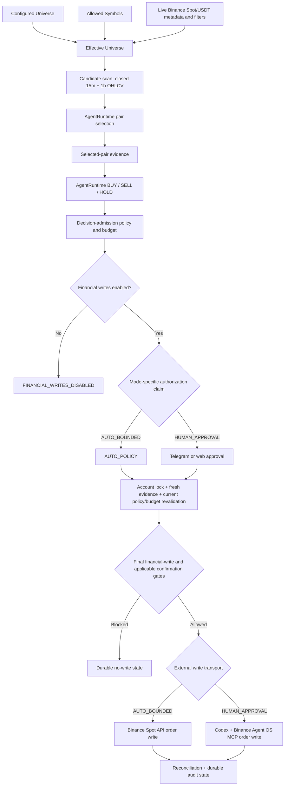

# DARWIN Architecture

## Authority boundary

DARWIN is a custom decision runtime, not a policy-free model wrapper. Its `AgentRuntime` uses the OpenAI SDK and optionally `OPENAI_BASE_URL` for an OpenAI-compatible endpoint. It makes two typed model calls:

1. `choose_pair()` returns one strict Pydantic `PairSelection`.
2. `decide()` returns one strict Pydantic `AgentDecision`: `BUY`, `SELL`, or `HOLD`, with pair/order details, confidence, rationale, supporting factors, and risk factors.

Invalid JSON, extra fields, or invalid Pydantic output gets one schema-correction attempt; unresolved output fails closed. Pydantic validates model output—it is not an agent framework.

The model decides a proposed trade. The deterministic backend owns the Trading Mandate, Allowed Symbols, Max Per Trade, 24h Trading Budget, Max Concurrent Trades, Configured Universe, balances, filters, freshness, open-order conflict, emergency stop, financial-write gate, and durable execution state.

## Decision flow



### Universe and evidence

A newly created Configured Universe defaults to `BTCUSDT`, `ETHUSDT`, `BNBUSDT`, `SOLUSDT`, and `XRPUSDT`. Owners may configure up to 100 valid uppercase Spot/USDT symbols. The five defaults are not a dynamic top-five strategy or a runtime limit. A database upgraded from before `0004_dual_execution_and_universe` can retain that migration's four-symbol compatibility value (`BTCUSDT`, `ETHUSDT`, `BNBUSDT`, `SOLUSDT`) until its owner explicitly updates the stored universe.

```text
Effective Universe = Configured Universe ∩ Allowed Symbols ∩ live-valid Binance Spot/USDT symbols
```

A cycle uses live exchange metadata and required filters to derive that intersection. It fetches 10 closed candles for `15m` and `1h` for every effective candidate with bounded concurrency of eight. A failed candidate is excluded, recorded as a sanitized failure in that run's `pair_selection` evidence, and does not create a child run. If no candidate remains, the cycle completes as `NO_EFFECTIVE_SYMBOLS`.

Configured-universe validation accepts up to 100 symbols. Candidate scanning processes the entire Effective Universe and is never silently truncated. A sufficiently large Effective Universe can exceed the worker's current 60-second cycle timeout; that cycle fails closed rather than creating a partial decision or silently reducing the candidate set.

After pair selection, the final decision receives selected-pair-only current ticker, balances, open orders, recent activity, filters, Trading Mandate, policy/budget snapshots, and 48 closed candles each for `15m`, `1h`, and `4h`. Candidate history remains audit evidence and is not forwarded to the final model call.

### Deterministic policy

A `BUY` or `SELL` must pass all applicable checks before it can create an actionable intent:

- exact membership in Configured Universe and Allowed Symbols;
- current live Binance Spot/USDT metadata and required filters;
- Max Per Trade / computed notional;
- rolling 24h Trading Budget and atomic active-workflow limit;
- available Spot balances;
- current evidence freshness and pair consistency;
- no conflicting open order; and
- emergency stop off.

A `HOLD` is a model decision. `SKIPPED` is a system outcome. Policy rejection, stale evidence, an invalid selected pair, a suppressed repeat signal, no Effective Universe, or a closed financial-write gate never becomes an exchange order.

## Execution modes

| Mode | Authorization | Evidence and transport | Approval semantics |
| --- | --- | --- | --- |
| `AUTO_BOUNDED` | `AUTO_POLICY` after policy admission | The direct backend-only **Binance Spot API** supplies exchange metadata, ticker, account, open orders, recent trades, filters, order submit/query, and emergency cancel. | No per-order human approval, Codex OAuth, or Telegram approval. |
| `HUMAN_APPROVAL` | durable approved `TradeIntentApproval` | **Binance Agent OS** is reached through Codex App Server + MCP. Codex is a transport/authentication adapter, not a decision authority. | Telegram callbacks and owner web approval call the same durable state machine. Telegram notification is not an `AUTO_BOUNDED` authorization mechanism. |

Both modes use a fresh revalidation, account-scoped lock, current policy/budget, idempotency key, write request hash, external-call marker, durable outbox, and reconciliation. `HUMAN_APPROVAL` can stop at a further observed Codex/Binance confirmation; DARWIN never auto-answers it. `CODEX_WRITE_CONFIRMATION_VERIFIED=false` blocks HUMAN_APPROVAL financial submission pending manual provider-contract verification.

## Financial-write safety

`DEMO_MODE=true` always blocks writes. With `DEMO_MODE=false` and `FINANCIAL_WRITES_ENABLED=false`, a policy-passing BUY/SELL ends as `FINANCIAL_WRITES_DISABLED` before an intent, approval, or financial transport is invoked.

Immediately before an external order call, DARWIN stores the request hash and `external_call_started_at`. A missing marker identifies known pre-call recovery. A recorded marker means the boundary may have been crossed, not that an order succeeded. `SUBMISSION_UNKNOWN` and marked `SUBMITTING` work reconcile before retry.

The system is Spot-only: no futures, margin, leverage, options, transfers, or withdrawals. A SELL uses held Spot inventory and cannot open a short. Model cancellation, cancel/replace, and direct web cancellation are disabled. Emergency stop blocks ordinary new work and queues narrow cancellation/reconciliation work for known affected intents.

## Durable state and migration head

`mandate_versions` stores immutable mandate versions. The current canonical free-text `trading_mandate` coexists with structured `allowed_symbols`, `max_order_notional`, and `max_open_actionable_intents`; legacy structured text is read through a compatibility projection without rewriting history.

The repository Alembic graph has one head:

```text
0006_canonical_trading_mandate
```

Migration lineage:

```text
0001_initial
→ 0002_oauth_and_event_dedupe
→ 0003_approval_outbox
→ 0004_dual_execution_and_universe (adds configured-universe compatibility data)
→ 0005_confirmation_reference
→ 0006_canonical_trading_mandate
```

The current head adds `mandate_versions.trading_mandate`; `0005` added stored Codex confirmation request/expiry fields. `0003_approval_outbox` is historical, not the current head.

## Public safe-live showcase

`GET /api/showcase` and frontend `/showcase` exist only when all of the following are true:

```dotenv
DEMO_MODE=false
FINANCIAL_WRITES_ENABLED=false
PUBLIC_SHOWCASE_ENABLED=true
```

The route reads persisted completed `SCHEDULED`/`RUN_ONCE` evidence. It neither invokes the model nor Binance and has no mutation seam. Its projection exposes selected decision fields, policy outcome, candidate/selected-pair market evidence, configured/allowed/effective symbols, freshness, and safe system outcomes. It explicitly excludes credentials, OAuth/session material, provider headers, Telegram identifiers, private balances, and hidden reasoning.

## Status

| Claim | Status |
| --- | --- |
| Runtime architecture, AgentRuntime, Pydantic validation, policy, transports, state machine, and public projection | **IMPLEMENTED** |
| Fresh non-financial Docker JUDGE DEMO: all three demo APIs and zero `agent_runs`/`trade_intents` rows | **VERIFIED** |
| Fresh Chromium `/demo` rendering and scenario selection | **VERIFIED** |
| Fresh unauthenticated Chromium shells for `/`, `/agent`, `/budget`, `/activity`, and `/settings` | **VERIFIED**; protected APIs returned expected `401` responses and no mutation was attempted |
| PUBLIC LIVE SHOWCASE Chromium rendering with its required live profile | **NOT VERIFIED** |
| Authenticated Binance Agent OS/Codex provider acceptance | **PENDING / NOT VERIFIED** |
| Funded direct Binance Spot order | **NOT VERIFIED** |

For runnable profiles and commands, see [LIVE.md](LIVE.md), [DEPLOYMENT.md](DEPLOYMENT.md), and [RUNBOOK.md](RUNBOOK.md).

## Post-Judging Architecture Roadmap [PLANNED / POST-JUDGING]

This section is a forward-looking architecture roadmap. It does not describe a
newly implemented runtime, does not change the status table above, and must not
be used to upgrade any current verification claim. All functionality described
below is **PLANNED / POST-JUDGING** until its own acceptance evidence exists.

### Core principle [PLANNED / POST-JUDGING]

**AI proposes. DARWIN authorizes. Binance executes.**

No model, host agent, or external interface is financial execution authority.
The reasoning engine may propose a trade. It is never financial authorization
authority. The deterministic DARWIN backend remains the sole financial
authorization authority for every financial write, regardless of which operating
mode or transport is active.

### User-facing operating modes [PLANNED / POST-JUDGING]

DARWIN has exactly two user-facing operating modes. They share the same
deterministic authorization services, policy engine, durable state, and audit
trail. They do not share the same reasoning engine.

```text
DARWIN
├── HUMAN_APPROVAL
└── AUTONOMOUS
```

| Mode | Reasoning engine | LLM API key in DARWIN | Persistent after host closes | Execution transport |
| --- | --- | --- | --- | --- |
| `HUMAN_APPROVAL` | External MCP host (Codex, Claude Code, Cursor, ChatGPT) | not required | no | Binance Agent OS MCP |
| `AUTONOMOUS` | DARWIN `AgentRuntime` (server-side) | required | yes | direct Binance Spot API |

#### HUMAN_APPROVAL [PLANNED / POST-JUDGING]

`HUMAN_APPROVAL` is the MCP-native interactive mode. An external MCP-compatible
host is the reasoning and planning engine. The host may inspect market and
account context, select a candidate trade, and propose it — but the host and
its model are never trusted as financial authorization.

```text
Codex / Claude Code / Cursor / ChatGPT
  |  reasoning + MCP tools
  |  may propose a candidate trade
  v
DARWIN MCP Server
  |  proposal validation (server-side)
  |  deterministic policy / mandate / budget / risk
  |  durable proposal submission
  v
Binance Agent OS MCP
  |  human / provider confirmation
  v
Binance
```

DARWIN does **not** require its own LLM API key in this mode. The host model
proposes; DARWIN independently validates current market/account state and all
financial values; DARWIN authorizes; Binance executes.

Host-provided pair, amount, price, confidence, rationale, or other values are
**untrusted proposal inputs**. DARWIN independently validates everything before
financial execution. The host may not authorize a financial write. The host may
not directly execute trusted financial writes. The host may not bypass DARWIN
policy.

Closing the MCP host ends the interactive reasoning session. No DARWIN-side
LLM API key should be required for this mode after future implementation.

**Current implementation vs post-judging target:** The current implementation
still uses DARWIN `AgentRuntime` for trade reasoning before human approval.
The post-judging architecture changes `HUMAN_APPROVAL` so the external MCP
host becomes the reasoning engine. This is a future reasoning-ownership
change only. DARWIN's deterministic authorization, durable approval state,
idempotency, reconciliation, and safety authority remain backend-owned.

Binance Agent OS MCP is the intended outbound execution integration where
applicable. Do not claim unattended autonomous writes through Binance Agent
OS MCP if provider confirmation is required by its provider contract.

#### AUTONOMOUS [PLANNED / POST-JUDGING]

`AUTONOMOUS` is the persistent server-side mode. DARWIN's own `AgentRuntime`
performs reasoning through the configured LLM provider. This mode requires a
configured LLM provider or API endpoint because DARWIN itself generates the
model calls.

```text
DARWIN worker
  |  DARWIN AgentRuntime
  |  configured LLM provider
  v
proposed trade
  |
  v
deterministic DARWIN policy / mandate / budget / risk
  |  fresh revalidation
  v
direct Binance Spot API
  |
  v
Binance
```

The worker can continue operating after any Codex/Claude/Cursor/ChatGPT
disconnects. No per-order human approval is required after deterministic policy
authorization. Direct Binance Spot API remains the execution transport.

The existing `AUTO_BOUNDED` implementation is the current internal name for
the `AUTONOMOUS` execution path. `AUTO_BOUNDED` terminology may appear in
code, logs, and implementation documentation where necessary for accuracy, but
the user-facing product mode is `AUTONOMOUS`.

For post-judging MCP and product surfaces, `AUTONOMOUS` is the user-facing
mode name and maps to the current internal `AUTO_BOUNDED` execution-mode
value until the internal enum is deliberately migrated. Users should
see and select `AUTONOMOUS`; existing code, logs, and storage may still
use `AUTO_BOUNDED`. A future `darwin.change_mode("AUTONOMOUS")` must map
server-side to the current internal `AUTO_BOUNDED` value until a real
enum migration is implemented. The current runtime does not yet accept
`AUTONOMOUS` directly as a mode value.

Host disconnect must not stop an already-running autonomous worker. The
execution transport remains separate from decision authority.

### Target architecture [PLANNED / POST-JUDGING]

The target is one shared deterministic authorization boundary for both modes.
`HUMAN_APPROVAL` and `AUTONOMOUS` both enter through the same policy, mandate,
budget, universe, account/market validation, durable intent, idempotency,
execution state, submission uncertainty, reconciliation, audit, and emergency
stop services. They do not share the same reasoning engine.

```text
HUMAN_APPROVAL path:
  MCP host reasoning → DARWIN MCP → proposal → shared authorization services
    → Binance Agent OS MCP → human/provider confirmation → Binance

AUTONOMOUS path:
  DARWIN AgentRuntime → proposed trade → shared authorization services
    → direct Binance Spot API → Binance

Shared authorization services:
  policy / mandate / budget / universe / account validation
  durable intent / idempotency / execution state
  submission uncertainty / reconciliation / audit / emergency stop
```

The web UI, REST API, future MCP handlers, and worker all call the same
shared application services. No business logic or financial policy is
duplicated across interfaces.

### Frontend positioning [PLANNED / POST-JUDGING]

The web UI may remain optional, legacy, operator-facing, or convenience UI.
MCP may become the primary post-judging control surface. The frontend is not
financial authority. The frontend is not a required dependency for either
`HUMAN_APPROVAL` or `AUTONOMOUS`.

### Inbound DARWIN MCP Server [PLANNED / POST-JUDGING]

Claude, Codex, ChatGPT, and other compatible MCP hosts will connect to a
future **DARWIN MCP Server**. The server must expose a read-only surface first
before any mutation tools are enabled.

For `HUMAN_APPROVAL`, the host reasoning enters through a proposal /
application-service seam. No DARWIN-internal LLM call is required. The
proposal enters the shared deterministic authorization services.

The server calls the same DARWIN application/domain services and durable state
machines used by the REST API and web UI. An MCP handler is an adapter at the
protocol seam, not a second policy engine, order writer, approval
implementation, or persistence model.

The server must not call Binance directly for a user-requested operation. It
must authenticate the host/operator, validate bounded tool input, authorize the
operation, and delegate to the existing authoritative module. This preserves
policy locality and gives REST, web, and MCP callers the same behavior, audit
trail, idempotency, reconciliation, and failure semantics.

Host-supplied pair, amount, price, confidence, or rationale are
**proposals/input only** and must be independently validated server-side. Do
NOT expose a raw unrestricted `place_order`, `buy`, or `sell` tool that
bypasses DARWIN policy.

### Outbound MCP for HUMAN_APPROVAL [PLANNED / POST-JUDGING]

Binance Agent OS MCP remains an outbound integration for applicable
MCP/human-confirmed workflows. For `HUMAN_APPROVAL`, DARWIN will connect
directly to the Binance Agent OS MCP endpoint as an MCP client using the
**official MCP Python SDK**. The outbound client owns transport, OAuth, tool
discovery, tool invocation, and protocol elicitation/confirmation handling.
The external MCP host owns reasoning and proposal generation. DARWIN still owns
financial authorization, mandate enforcement, deterministic policy, approval
state machine, financial-write gating, submission uncertainty, reconciliation,
durable state, and audit.

The current Codex-specific App Server bridge remains the active implementation
seam documented above. It is planned for removal only after direct OAuth, tool
discovery, tool calling, elicitation/confirmation, submission-uncertainty, and
reconciliation parity have all been verified against the real Binance Agent OS
contract. Until then, the existing `CODEX_WRITE_CONFIRMATION_VERIFIED=false`
fail-closed behavior and **PENDING / NOT VERIFIED** status must remain unchanged.
No bridge removal is implied by this roadmap document.

### AUTONOMOUS execution path [PLANNED / POST-JUDGING]

The existing `AUTO_BOUNDED` direct Binance Spot API architecture is the
current implementation of the `AUTONOMOUS` execution path:

```text
DARWIN
  → deterministic backend authorization
  → fresh revalidation
  → direct Binance Spot API
  → Binance
```

It remains architecturally independent of MCP, Codex OAuth, and per-order human
approval. The roadmap must not route `AUTONOMOUS` through the future DARWIN
MCP Server or through Binance Agent OS MCP, and must not weaken its existing
policy, freshness, idempotency, write-marker, or reconciliation controls.

Keep execution transport separate from decision authority.

### Operator interfaces and runtime authority [PLANNED / POST-JUDGING]

In `HUMAN_APPROVAL` mode, the external MCP host is the reasoning engine.
DARWIN is the deterministic authorization/policy layer. The host model may
propose a candidate trade, but the deterministic backend must remain the only
financial authorization authority. The host may not authorize a financial write
or bypass backend policy.

In `AUTONOMOUS` mode, DARWIN's `AgentRuntime` is the reasoning engine and the
deterministic backend is the authorization authority.

Closing or disconnecting an MCP host must not stop an already-running
`AUTONOMOUS` agent. Agent execution is owned by DARWIN's durable server-side
runtime and worker state, not by the lifetime of an MCP host session. A host
disconnect may end that host's request/session, but it must not cancel a running
cycle or disable the backend's authorization and recovery controls.

### Shared authorization services [PLANNED / POST-JUDGING]

Both modes enter through the same shared deterministic authorization services.
They do not need to share the same reasoning engine.

| Shared authoritative module/seam | HUMAN_APPROVAL responsibility | AUTONOMOUS responsibility |
| --- | --- | --- |
| deterministic policy, mandate, budget, universe, account/market validation | Host proposal enters through MCP application-service seam; DARWIN validates independently | `AgentRuntime` / `DecisionCycle` propose; DARWIN validates the same way |
| `Repository` and versioned mandate/budget state | Read current durable state and persist mutations through the same transaction rules | Same |
| `ExecutionGateway` and execution checks | Reuse symbol, notional, budget, balance, filter, freshness, open-order, and emergency-stop checks | Same |
| `TradeIntentApprovalService` | Own approve/reject/expiry/claim/consume transitions for HUMAN_APPROVAL approval channel | Not used by the default AUTONOMOUS execution path; AUTONOMOUS has no per-order human approval after deterministic authorization. Only relevant if a future explicitly approval-required workflow is introduced for AUTONOMOUS. |
| `ApprovedExecution` and reconciliation | Own revalidation, write-boundary markers, confirmation uncertainty, external submission, and recovery | Same |
| emergency-stop branch and audit event path | Keep emergency stop authoritative, deduplicated, and reconciliation-safe | Same |

If a caller-facing operation lacks a suitable shared module, the maintenance
work should first deepen that module at its existing seam. MCP handlers must
remain thin adapters with no duplicate business logic, policy predicates,
financial calculations, or state transitions. The interface is the test
surface: REST, web, and MCP acceptance should exercise the same authoritative
implementation and produce equivalent durable outcomes.

Do not design separate policy engines for different interfaces.

### Planned MCP tool surface [PLANNED / POST-JUDGING]

Tool names are the proposed stable namespace. Each tool must expose bounded
input/output schemas, actionable errors, explicit read/write annotations, and
structured results suitable for MCP hosts. Activity and list-like results must
be bounded and paginated rather than returning unbounded database contents.

MCP handlers must remain thin adapters over shared DARWIN application/domain
services. No business logic or financial policy should be duplicated inside MCP
handlers.

#### Read / observability [PLANNED / POST-JUDGING]

- `darwin.get_status`
- `darwin.get_mandate`
- `darwin.get_budget`
- `darwin.get_universe`
- `darwin.get_portfolio`
- `darwin.get_latest_decision`
- `darwin.get_activity`
- `darwin.list_pending_trades`
- `darwin.get_recent_decisions`

These tools are read-only projections. They must apply the same redaction rules
as the authenticated web/API projections and must not expose credentials, OAuth
or session material, provider headers, Telegram identifiers, private data beyond
the authorized operator view, or hidden reasoning.

#### Proposal validation [PLANNED / POST-JUDGING]

- `darwin.validate_proposal`

This tool accepts a host-supplied trade proposal (pair, amount, price,
confidence, rationale) and returns the deterministic policy evaluation without
creating durable intent. Host-supplied values are proposals only; the result
reflects server-side validation against the current mandate, budget, universe,
filters, and freshness. This tool must not create durable intent or trigger
financial transport. Use this for dry-run evaluation before submission.

#### Durable proposal submission [PLANNED / POST-JUDGING]

- `darwin.submit_proposal` (name provisional)

This tool accepts a host-supplied trade proposal and routes it through the
`HUMAN_APPROVAL` durable execution workflow. It must:

- accept the host proposal as untrusted input;
- independently fetch and revalidate current market/account state;
- enforce the trading mandate, allowed/configured universe, budget, max
  notional, balance requirements, Binance filters, freshness, open-order
  conflict checks, and emergency stop;
- enforce execution-mode requirements;
- use idempotency and replay protection;
- create durable intent only after deterministic admission;
- route to the `HUMAN_APPROVAL` execution workflow (Binance Agent OS MCP
  for provider confirmation where applicable);
- never expose unrestricted `place_order`, `buy`, or `sell`;
- never trust client-computed policy results; and
- never trust client-provided final Binance execution arguments.

The exact final name may remain provisional until implementation stabilizes.

#### Agent control [PLANNED / POST-JUDGING]

- `darwin.run_once` — **AUTONOMOUS mode only.**
- `darwin.start`
- `darwin.stop`

`darwin.run_once` invokes `AgentRuntime` / `DecisionCycle` and is
AUTONOMOUS-specific. It must not bypass the normal DecisionCycle, policy
admission, write gate, or selected execution mode. Do not imply that
`HUMAN_APPROVAL` / MCP reasoning requires DARWIN's `AgentRuntime`.

`darwin.start` and `darwin.stop` control the durable worker state and apply
to the persistent autonomous runtime.

#### Human approval [PLANNED / POST-JUDGING]

- `darwin.approve_trade`
- `darwin.reject_trade`
- `darwin.resolve_execution_confirmation`

Each tool must resolve an opaque durable reference server-side and delegate to
`TradeIntentApprovalService` or the existing execution-confirmation state
machine. Tool arguments must not carry client-trusted pair, amount, price,
recipient, policy result, or final Binance arguments. A confirmation response
must preserve the conservative submission marker and reconciliation-first
behavior; accepting a confirmation must never blindly emit a new financial
request.

#### Owner configuration [PLANNED / POST-JUDGING]

- `darwin.update_mandate`
- `darwin.update_budget`
- `darwin.change_mode`
- `darwin.update_universe`

These tools must delegate to the same versioned mandate, budget, mode, and
universe validation paths as REST/web. They must preserve immutable mandate
history, live Spot/USDT symbol validation, bounded values, and current mode
preconditions. Each mutation must record auditable before/after state without
recording secrets.

For `darwin.change_mode`, the post-judging user-facing value `AUTONOMOUS`
must map server-side to the current internal `AUTO_BOUNDED` execution-mode
value until the internal enum is deliberately migrated. The current runtime
does not yet accept `AUTONOMOUS` directly; the mapping is a future
implementation detail.

#### Emergency stop [PLANNED / POST-JUDGING]

- `darwin.emergency_stop`

`darwin.emergency_stop` must call the existing authenticated emergency-stop
branch, including durable target selection, deduplicated cancellation work, and
reconciliation. It must not create an MCP-only cancellation path.

#### Safety and guardrails [PLANNED / POST-JUDGING]

Guardrails and immutable execution-safety invariants remain backend-enforced.
They are not exposed as mutable MCP tools. No MCP tool may weaken, disable, or
bypass the safety architecture described below.

### Mutation authorization and audit contract [PLANNED / POST-JUDGING]

The following rules apply to every future mutation tool. The MCP server must
perform protocol-level authentication and authorization, then call the same
backend application service/state machine used by REST and the web UI. It must
never reimplement policy, compute trusted financial values from client input, or
write durable state directly from a handler.

| Tool class | Required authorization | Required backend behavior and audit |
| --- | --- | --- |
| Read-only tools | Normal authenticated operator access | Return an authorized, redacted projection only; no mutation or financial transport. |
| `darwin.validate_proposal` | Normal authenticated operator access | Evaluate host-supplied proposal against current policy; return pass/reject with reasons; no durable intent created. |
| `darwin.submit_proposal` | Authenticated owner authorization | Accept untrusted proposal; independently revalidate market/account state; enforce all policy checks; create durable intent only after admission; route to HUMAN_APPROVAL execution workflow; audit proposal, validation outcome, and intent creation. |
| `darwin.run_once` (AUTONOMOUS only) | Authenticated owner authorization | Invoke `AgentRuntime` / `DecisionCycle`; use the existing agent control/decision flow and record the operator action and resulting state. |
| `darwin.start`, `darwin.stop` | Authenticated owner authorization | Control the durable autonomous worker state; record operator action. |
| `darwin.approve_trade`, `darwin.reject_trade`, `darwin.resolve_execution_confirmation` | Authenticated owner authorization | Use the durable approval/confirmation state machine, opaque server-side references, conditional transitions, idempotency, and audit events. |
| `darwin.update_mandate`, `darwin.update_budget`, `darwin.change_mode`, `darwin.update_universe` | Stronger mutation authorization | Require authenticated owner mutation access; validate server-side; persist auditable before/after state and version/hash metadata. |
| `darwin.emergency_stop` | Authenticated owner authorization with the existing recent-reauthentication requirement | Use the existing emergency-stop state and cancellation/reconciliation path; audit operator identity, targets, and outcomes. |

The server must also apply bounded request sizes, rate limits, timeouts,
replay/idempotency controls, request correlation IDs, and safe structured error
responses. OAuth access tokens presented to the inbound MCP server must be
validated for the DARWIN resource/audience and must never be passed through as
Binance credentials. A host identity is not itself owner authorization.

### Immutable execution-safety invariants [PLANNED / POST-JUDGING]

The backend must continue enforcing these immutable invariants regardless of
operating mode or any future configuration surface:

- Spot-only execution;
- no futures, margin, leverage, or options;
- no withdrawals or transfers;
- authentication and authorization;
- the financial-write enablement boundary;
- durable intent and idempotency guarantees;
- submission-uncertainty handling and reconciliation; and
- emergency-stop capability.

No MCP tool, host agent, or external interface may turn an untrusted host or
client payload into execution authority, remove fresh revalidation, disable the
financial-write gate, permit a blind retry after `SUBMISSION_UNKNOWN`, remove
account serialization, or make emergency stop unavailable. Every financial write
remains backend-authorized and attributable.

### Phased implementation roadmap [PLANNED / POST-JUDGING]

The following phases describe future implementation work only. They do not
change the current implementation or verification status above. Each phase
must pass its exit gate before the next mutation surface is enabled.

1. **Phase 1 — Shared application-service boundary [PLANNED / POST-JUDGING].**
   Extract reusable application-service functions from FastAPI routes where
   necessary. Preserve the existing route contracts and REST behavior exactly.
   The Next.js/web REST path, future inbound MCP handlers, and worker must call
   the same application/domain services; REST and MCP must never grow separate
   business logic, policy calculations, persistence rules, or state machines.

   **Exit gate:** real REST behavior remains unchanged; shared service calls
   produce the same durable readback; no MCP handler directly writes Binance or
   manipulates durable execution state.

2. **Phase 2 — Inbound DARWIN MCP read-only surface [PLANNED / POST-JUDGING].**
   Add the future inbound DARWIN MCP Server as a thin adapter over the shared
   application services. Expose read-only tools first:
   `darwin.get_status`, `darwin.get_mandate`, `darwin.get_budget`,
   `darwin.get_universe`, `darwin.get_portfolio`, `darwin.get_latest_decision`,
   `darwin.get_activity`, `darwin.list_pending_trades`,
   `darwin.get_recent_decisions`. Read tools must use the same authorized and
   redacted projections as REST/web.

   **Exit gate:** compatible-host discovery and real read-only calls work with
   correct schemas, redaction, authentication, pagination, rate limiting, and
   audit correlation; mutation tools remain disabled until their authorization
   and state-machine tests pass.

3. **Phase 3 — HUMAN_APPROVAL proposal and durable submission
   [PLANNED / POST-JUDGING].** Add `darwin.validate_proposal` for dry-run
   policy evaluation and `darwin.submit_proposal` (name provisional) for
   durable proposal submission into the HUMAN_APPROVAL execution workflow.
   Add emergency stop (`darwin.emergency_stop`). Host reasoning enters through
   the MCP proposal/application-service seam; no DARWIN-internal LLM call is
   required. DARWIN independently validates all financial values.

   **Exit gate:** proposal validation returns correct pass/reject with policy
   reasons; durable submission creates intent only after deterministic
   admission; emergency stop uses the same durable cancellation path; no MCP
   handler creates duplicate policy or execution logic.

4. **Phase 4 — Owner configuration and control via MCP [PLANNED / POST-JUDGING].**
   Add the owner configuration tools:

   - `darwin.update_mandate`
   - `darwin.update_budget`
   - `darwin.change_mode`
   - `darwin.update_universe`

   Every mutation must be audited and must reuse the existing server-side
   validation, versioning, mode-precondition, symbol/filter, budget, and
   authorization logic. Before/after state must be attributable without
   recording secrets, and caller-supplied values must not override backend
   invariants.

   **Exit gate:** stronger owner mutation authorization, validation failures,
   concurrent updates, idempotent retries, before/after audit readback, and
   unchanged REST/web behavior are verified.

5. **Phase 5 — Direct Binance Agent OS MCP integration/parity for
   HUMAN_APPROVAL [PLANNED / POST-JUDGING].** Make the official MCP Python
   SDK the primary Binance Agent OS transport for `HUMAN_APPROVAL`, reusing
   the existing `BinanceAgentOSClient` foundations, typed mappers,
   `ToolCatalog`, and durable execution modules. Verify the full OAuth
   lifecycle, tool discovery and schema validation, read calls, write
   elicitation/confirmation, and transport error handling against the real
   provider. Preserve durable HUMAN_APPROVAL approval semantics, fresh
   revalidation, write-boundary markers, submission uncertainty, and
   reconciliation. Remove the Codex-specific App Server bridge only after
   direct behavior has parity evidence, including in-flight recovery.

   **Exit gate:** authenticated direct OAuth, discovered tools, harmless read
   calls, exact write schemas, explicit confirmation decline/cancel/expiry,
   conservative `SUBMISSION_UNKNOWN`, correlated order lookup, and
   reconciliation are all verified. Until then, the current bridge and
   `PENDING / NOT VERIFIED` status remain authoritative.

6. **Phase 6 — AUTONOMOUS runtime cleanup and mode-aware dependencies
   [PLANNED / POST-JUDGING].** Clean up the `AUTONOMOUS` mode runtime and
   make worker configuration validation mode-aware so that Codex/App Server
   dependencies are not required for modes that do not use them. Ensure
   `HUMAN_APPROVAL` mode does not pull in autonomous-only dependencies
   (LLM provider, direct Binance Spot API credentials for execution). Do not
   change code now; document the known cleanup item for later implementation.

   **Exit gate:** `HUMAN_APPROVAL` mode starts without LLM provider
   configuration; `AUTONOMOUS` mode requires LLM provider configuration;
   worker config validation is mode-aware; no dead dependency paths in either
   mode.

7. **Phase 7 — Remote multi-host MCP access [PLANNED / POST-JUDGING].**
   Support compatible remote MCP hosts through authenticated remote MCP access.
   Define caller identity and audit attribution, rate limiting, request and
   session isolation, and session/token lifecycle behavior. Remote access must
   remain stateless or durably coordinated across replicas; disconnecting a
   host must not stop an already-running `AUTONOMOUS` agent. Implement only
   after local MCP behavior is verified.

   **Exit gate:** remote authentication/audience checks, identity attribution,
   token rotation/revocation, rate-limit enforcement, timeout behavior,
   multi-replica/load-balancer tests, and host-disconnect independence are
   verified with real protocol traffic.

### Verification gates before any future rollout [PLANNED / POST-JUDGING]

No future phase is complete from source inspection alone. Evidence must include
as applicable:

- real MCP `tools/list` and tool-call interoperability with supported hosts;
- schema, redaction, pagination, timeout, rate-limit, and structured-error
  checks;
- authenticated read access and denial of unauthenticated access;
- owner authorization for control, proposal submission, approval, rejection,
  and configuration mutations;
- stronger mutation authorization plus before/after audit readback for mandate,
  budget, mode, and universe changes;
- proposal validation returning correct pass/reject with policy reasons;
- durable proposal submission creating intent only after deterministic
  admission, with idempotency and replay protection;
- parity readback showing REST, web, and MCP use the same durable state and
  state-machine outcomes, with no duplicate policy in handlers;
- concurrent duplicate/replay requests proving idempotency and no duplicate
  approval or financial work;
- unchanged `AUTONOMOUS` behavior through direct Binance Spot API, including
  deterministic authorization, fresh revalidation, write gating, and
  reconciliation;
- real Binance Agent OS direct-SDK OAuth, discovery, read-only calls, tool
  calls, elicitation/confirmation, decline/cancel/expiry, submission-unknown,
  and reconciliation evidence;
- mode-aware worker configuration validation proving `HUMAN_APPROVAL` does not
  require LLM provider or App Server dependencies;
- multi-replica/load-balancer behavior with no critical MCP session, lock,
  approval, or confirmation state held only in process memory; and
- rollback/recovery evidence showing the Codex bridge remains available until
  direct parity and in-flight recovery are proven.

Until these gates produce fresh evidence, the implementation and verification
status tables above remain authoritative and unchanged. The canonical sources
for protocol behavior are the [MCP tools specification](https://modelcontextprotocol.io/specification/2025-06-18/server/tools.md),
[MCP authorization specification](https://modelcontextprotocol.io/specification/2025-06-18/basic/authorization.md),
[MCP elicitation specification](https://modelcontextprotocol.io/specification/2025-06-18/client/elicitation.md),
and the [official MCP Python SDK](https://github.com/modelcontextprotocol/python-sdk).
